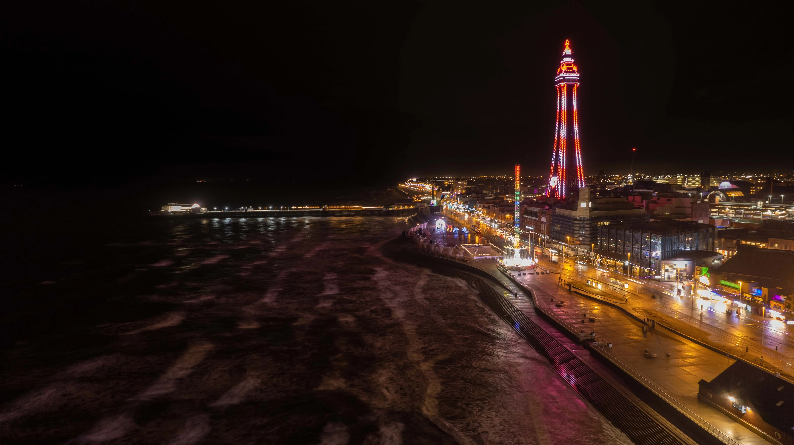
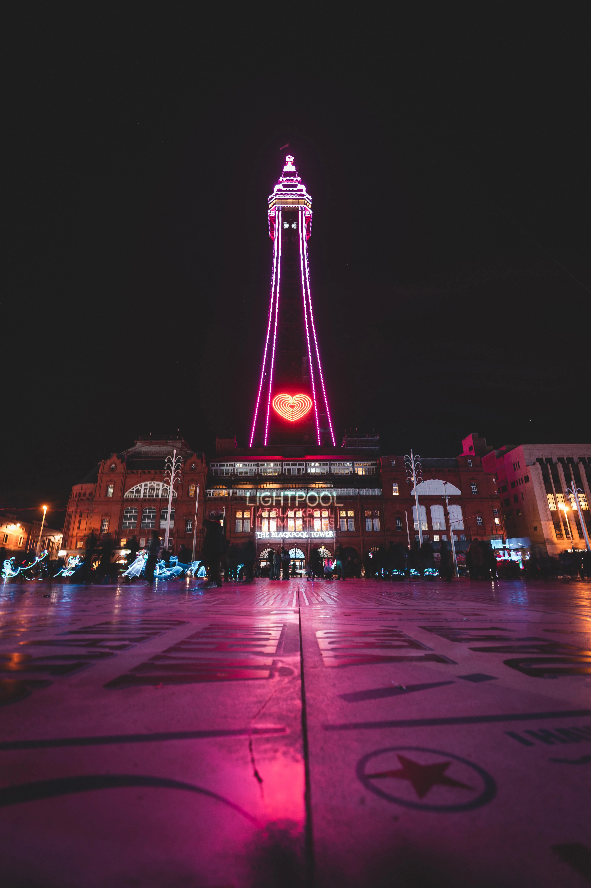
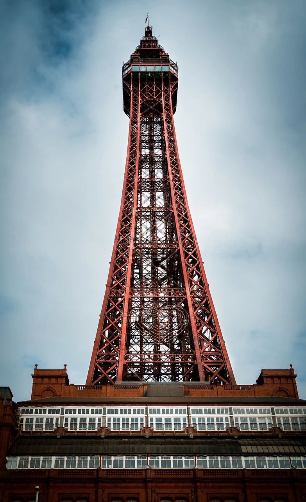

        The Blackpool Tower

[

Blackpool Tower
===============

](index.html)

* 
* [Past](#past-section)
* [Present](#present-section)
* [Gallery](#gallery-section)
* [Map](#map-section)
* 

The Blackpool Tower
-------------------

An introduction to what's worth knowing about the iconic northern landmark

The Blackpool Tower
-------------------

Standing tall on the central promenade since 1894, the design of this no. 1 attraction was undeniably inspired by the Eiffel Tower in Paris.

Today, Blackpool Tower welcomes thousands of visitors each year to the archetypal northern English seaside town, promising fun for all the family.

It is home to the grand Tower Ballroom which boasts a real Wurlitzer organ and a rich history of hosting dance shows beneath 14 ornate chandeliers. \[See video below.\]

At ground level is the Tower Circus where a live band provides the shows' dynamic musical accompaniment. The circus has never missed a season since beginning in 1894.

A stunning panoramic view can be experienced from a height of 115m via the Blackpool Tower Eye and those who have the nerve can stand on a glass viewing platform, the SkyWalk, to look down onto the promenade below.

Another top attraction here is the Blackpool Tower Dungeon experience hosted by Merlin Entertainment, featuring a dungeon-themed Escape Room.

#### Watch

Discover the Tower Ballroom from the unique perspective of a talented organist as he begins work.

Past
----

The Blackpool Tower was commissioned in 1890 by Sir John Bickerstaffe who was the town's mayor at that time. He had returned from the World Trade Fair in Paris a year earlier and was so impressed by the sight of the newly unveiled _Tour Eiffel_, decided his beloved hometown should have one of its very own.

Lancashire architects James Maxwell and and Charles Tuke designed the structure but both men had passed away before its completion in 1894. The construction took four years, using five million bricks and more than 2,000 tons of steel and cast iron.

The first visitors paid sixpence to ride the lifts to the top.

A Grade I listed building, the Blackpool Tower stands at 152m tall.

Present
-------

The Blackpool Tower is visited by 650,000 people every year. With a variety of entertainment options on offer, it is a magnet for folks of all ages. Entry to the Tower is free. Tickets for special shows and events can be purchased in the box office and online.

School trips are also facilitated here and Heritage tours are offered, providing opportunities that are both educational and memory-making.

Other features include a seasonal Tower Top Garden and Sunset Sessions with cocktails and live music. Evening entertainment comes in the form of concerts, parties and discos in a range of musical genres. There are also variety shows and dance competitions in the magnificent, internationally renowned ballroom. There is a mini golf attraction as well as a popular bingo game.

Gallery
-------

 

 

 

Visit
-----

The Blackpool Tower  
The Promenade  
FY1 4BJ  

Sign up
-------

Join the mailing list to receive information about all of the news and exciting events happening at The Blackpool Tower.

Name\*

Email

Message

Send

* 
* 
* 
* 

* * *

copyright © jillusc 2023
